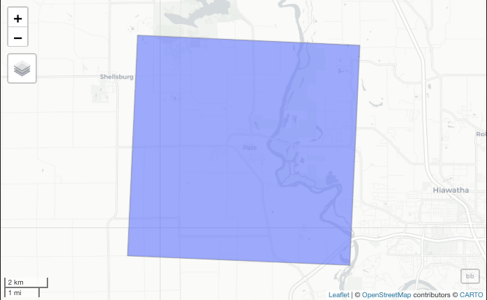
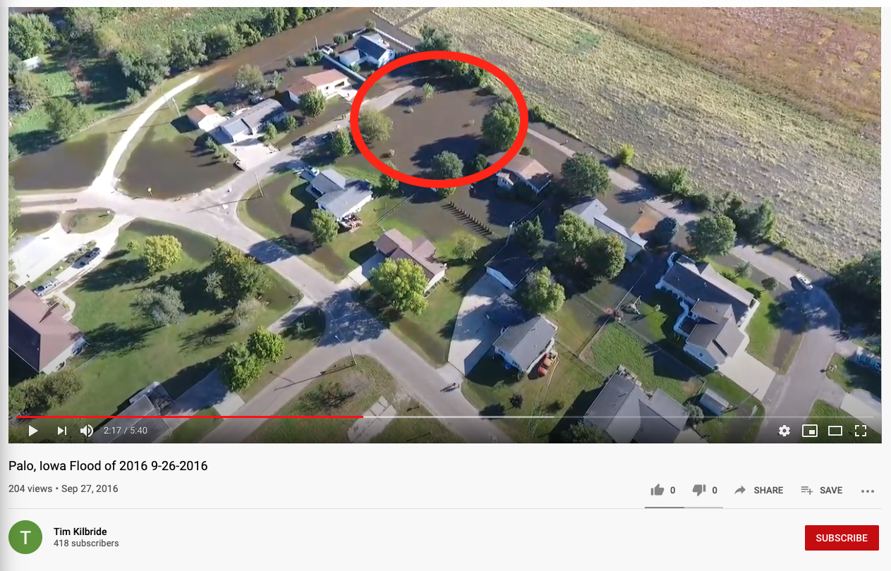

Libraries used for this project:
```{r,, warning=F, message=F}
library(tidyverse)
library(sf)
library(raster)
library(getlandsat)
library(mapview)
library(leaflet)
library(stats)
```

*****

## Question 1: Identifying the AOI
```{r,warning=F,message=F,echo=F}
bb = read_csv("~/github/geog-176A-labs/data/uscities.csv") %>%
  filter(city  == "Palo") %>%
  st_as_sf(coords = c("lng", "lat"), crs = 4326) %>%
  st_transform(5070) %>%
  st_buffer(5000) %>%
  st_bbox() %>%
  st_as_sfc

```
<center>

</center>

This region defines the AOI for this analysis.  We will be looking at Palo, Iowa and its surroundings in order to extract its flood extents. The bounding box is a 5000 meter buffer around the point.

*****

## Question 2: Loading in Images as Multiband Raster Object in R and Crop to Domain of AOI

<center>
```{r,warning=F,message=F,echo=F}
meta = read_csv("~/github/geog-176A-labs/data/palo-flood.csv")

files = lsat_scene_files(meta$download_url) %>%
  filter(grepl(paste0("B",1:6,".TIF$", collapse = "|"), file)) %>%
  arrange(file) %>%
  pull(file)

st = sapply(files, lsat_image)

s = stack(st) %>%
  setNames(paste0("band", 1:6))

plot(s)

s
```
</center>

As shown above the dimensions of the stacked image are 7811, 7681, 59996291, 6.  The CRS is +proj=utm +zone=15 +datum=WGS84 +units=m +no_defs.  The cell resolution is 30, 30.

<center>
```{r,warning=F,message=F,echo=F}
cropper = bb %>%
  st_as_sf() %>%
  st_transform(crs(s))

r = crop(s, cropper)

r = r %>% 
  setNames(c("Coastal Aerosol", "Blue", "Green", "Red", "Near Infrared", "SWIR 1"))

plot(r)

r
```
</center>

The dimensions of the cropped image stack are 340, 346, 117640, 6.  The CRS is +proj=utm +zone=15 +datum=WGS84 +units=m +no_defs and the cell resolution is also 30, 30.

*****

## Question 3: Visualization Through RGB plots and Stretches

### Landsat Images Without Color Stretch
<center>
```{r,warning=F,message=F,echo=F}
plotRGB(r, r = 4, g = 3, b = 2)

print("R-G-B (natural color)")

plotRGB(r, r = 5, g = 4, b = 3)

print("NIR-R-G(fa) (color infrared)")

plotRGB(r, r = 5, g = 6, b = 4)

print("NIR-SWIR1-R (false color water focus)")

plotRGB(r, r = 7, g = 6, b = 4)

print("SWIR2-SWIR1-R")
```
</center>

### Landsat Images With Color Stretch
<center>
```{r,warning=F,message=F,echo=F}
plotRGB(r, r = 4, g = 3, b = 2, stretch = "hist")

print("R-G-B (natural color)")

plotRGB(r, r = 5, g = 4, b = 3, stretch = "lin")

print("NIR-R-G(fa) (color infrared)")

plotRGB(r, r = 5, g = 6, b = 4, stretch = "lin")

print("NIR-SWIR1-R (false color water focus)")

plotRGB(r, r = 7, g = 6, b = 4, stretch = "hist")

print("SWIR2-SWIR1-R")
```
</center>

The purpose of using a stretch is to put more contrast into the images by reducing the variability by stretching the image.  Instead of using the maximum/minimum possible RGB values, it uses minimum and maximum values that exist in the image.  This overall increases the contrast of the image effect and makes it look a little bit nicer.

*****

## Question 4: Utilizing Raster Algebra and Raster Thresholding
<center>
```{r,warning=F,message=F,echo=F}
ndvi = (r$Near.Infrared - r$Red) / (r$Near.Infrared + r$Red)

ndwi = (r$Green - r$Near.Infrared) / (r$Green + r$Near.Infrared)

mndwi = (r$Green - r$SWIR.1) / (r$Green + r$SWIR.1)

wri = (r$Green + r$Red) / (r$Near.Infrared + r$SWIR.1)

swi = 1 / (sqrt(r$Blue - r$SWIR.1))

stack = stack(ndvi, ndwi, mndwi, wri, swi) %>% 
  setNames(c("NDVI", "NDWI", "MNDWI", "WRI", "SWI"))

palette = colorRampPalette(c("blue","white","red"))

plot(stack, col = palette(256))
```
</center>

In terms of the similarity between all these images, they all split the image into two parts by color.  The blue part is prominent in both the NDVI and SWI image while that same area of land is red in the NDWI, MNDWI, and WRI images.  The NDWI, MNDWI, and WRI images show the water threshold at cells greater than 0 and 1 while the NDVI shows the water threshold at cells less than 0.  NDVI is used to show the normalized difference vegetation index, NDWI shows the normalized difference water index, MNDWI is a modified version of the NDWI, WRI show the water ratio index, and the SWI show the simple water index.

<center>
```{r,warning=F,message=F,echo=F}
thresholding1 = function(x){ifelse(x <= 0,1, 0)}
thresholding2 = function(x){ifelse(x >= 0,1, 0)}
thresholding3 = function(x){ifelse(x >= 1,1, 0)}
thresholding4 = function(x){ifelse(x <= 5,1, 0)}
thresholding5 = function(x){ifelse(is.na(x), 0, 1)}

flood1 = calc(ndvi, thresholding1)
flood2 = calc(ndwi, thresholding2)
flood3 = calc(mndwi, thresholding2)
flood4 = calc(wri, thresholding3)
flood5 = calc(swi, thresholding4)
flood5 = calc(swi, thresholding5)


stack1 = stack(flood1, flood2, flood3, flood4, flood5) %>% 
  setNames(c("NDVI", "NDWI", "MNDWI", "WRI", "SWI")) 

plot(stack1, colNA = "white", col = c("white","blue"))
```
</center>

Through raster thresholding I was able to create the graph above which is a binary flood raster showing the flooded areas in blue and the non-flooded areas in white for each of the different images.

*****

## Question 5: Using K-Means Algorithm to Group Raster Cells With Similar Spectral Properties

```{r,warning=F,message=F,echo=F}
set.seed(09032020)

values = getValues(r)

dim(values)

```

In terms of the dimensions of the extracted values, there are 117,640 rows and 6 columns, one column for each different band of the raster stack.  This shows that the data was extracted cell-by-cell for each of the methods as there are 6,705,840 points (117,640 cells for each method).

<center>
```{r,warning=F,message=F,echo=F}
values = na.omit(values)

extract = kmeans(values, 12, iter.max = 100)

kmeans_raster = r$Coastal.Aerosol
values(kmeans_raster) = extract$cluster

values1 = values(stack1$NDVI)

table1 = table(values1, values(kmeans_raster))

idx = which.max(table1[2,])

threshold6 = function(x){ifelse(x == idx, 1, 0)}

flood6 = calc(kmeans_raster, threshold6)

stack1 = addLayer(stack1, flood6)

names(stack1)[6] = "K Means"

plot(stack1, colNA = "white", col = c("white","blue"))

```
</center>

In this, we used unsupervised classification to identify similar features in a continuous field.  For this, I specified 12 different clusters and the algorithm created a categorization based on patterns in the data.  Then I added this layer back into the raster stack to show it next to all the other methods of displayed the flood.

*****

## Question 6: Summary

```{r,warning=F,message=F,echo=F}
kabletable = cellStats(stack1, sum)

knitr::kable(kabletable, caption = "Number of Flooded Cells per Image", col.names = c("Number"))
```

Since we know that each cell has a resolution of 30 meters by 30 meters, each cell has an area of 900 meters squared.  We then multiply 900 by the number of cells to get the total flooded area in each image.


```{r,warning=F,message=F,echo=F}
areakable = kabletable * 900

knitr::kable(areakable, caption = "Area of Flooded Cells (m^2)", col.names = c("Area"))
```
<center>
```{r,warning=F,message=F,echo=F}
sumraster = calc(stack1, fun=sum)

plot(sumraster, col = blues9)
```
</center>

We can visualize the uncertainty in our classifications by summing the entire stack using the calc function. The higher the count in each pixel, the more certain we can be about its flooded state. For example, if a cell has a value of 6, it indicates that every method identified the cell as flooded, if it has a value of 2 then we know that two of the methods identified the cell as flooded.


When looking at a mapview of raster, it is evident that in certain areas the pixel level is not a whole number.  My explanation for this would be that this is caused by the overall resolution of the image.  If we were to perform an aggregate function on the image in order to reduce the resolution so that each cell has solely one color, each cell would have a whole number for its pixel level.  Because the image is higher quality, the colors can be a little mixed which gives us decimals for the pixel levels.

*****

## Question 7: Checking Flood Raster Against Real Drone Footage of Flood

<center>

</center>

Using context clues, I was able to find the exact location of the image above on the map with the bounding box of Palo, Iowa.  Using the latitude and longitude of that point, I created an sfc object in order to extract the binary flood values at that specific location from the six layer flood map stack.  As you can see below, in each of the layers, the value at this point is 1 which means that all of the layers capture flooding at this specific location.

```{r,warning=F,message=F,echo=F}
point = st_point(c(-91.78959, 42.06305)) %>% 
  st_sfc(crs = 4326) %>% 
  st_transform(crs(stack1)) %>% 
  as_Spatial()

print("Lng = -91.78959, Lat = 42.06305")
raster::extract(stack1, point)
```

<center>
```{r, echo=FALSE}
library(icon)
fa("globe", size = 5, color="green")
```
</center>
