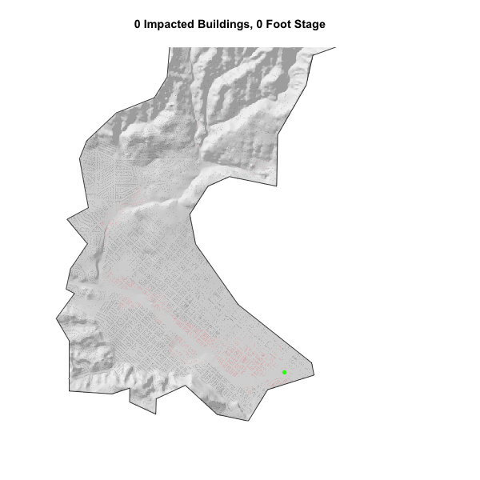

  
Libraries used for this project:
```{r, warning=F, message=F}
library(tidyverse)
library(sf)       
library(raster)   
library(fasterize) 
library(whitebox)  
library(gifski)
library(knitr)

# Data libraries
library(osmdata)   
library(elevatr) 
```


## Question 1: Collecting Data
```{r, warning=F, echo=F, message=F}
basin = read_sf("https://labs.waterdata.usgs.gov/api/nldi/linked-data/nwissite/USGS-11119750/basin")

elev = elevatr::get_elev_raster(basin, z = 13) %>% 
  crop(basin) %>% 
  mask(basin)

elev = elev * 3.281

```

```{r, eval=F, warning=F, echo=F, message=F}
writeRaster(elev, "../data/Mission-Creek-Elev.tif", overwrite = T)
```

```{r, warning=F, echo=F, message=F}
elev_raster = raster("../data/Mission-Creek-Elev.tif")

bb = st_bbox(basin) %>% 
  st_as_sfc() %>% 
  st_transform(4326)

build = osmdata::opq(bb) %>% 
  add_osm_feature(key = "building") %>% 
  osmdata_sf()

building_point = build$osm_polygons %>% 
  st_intersection(basin) %>% 
  st_transform(crs(basin)) %>% 
  st_centroid()

building_poly = build$osm_polygons %>% 
  st_intersection(basin) %>% 
  st_transform(crs(basin))

rail = opq(bb) %>% 
  add_osm_feature(key = "railway", value = "station") %>% 
  osmdata_sf()

railway = rail$osm_points %>% 
  st_intersection(basin) %>% 
  st_transform(crs(basin))

osm = opq(bb) %>% 
  add_osm_feature(key = "waterway", value = "stream") %>% 
  osmdata_sf()

stream = osm$osm_lines %>% 
  st_intersection(basin) %>% 
  st_transform(crs(basin))
```
Background: Mission Creek runs from Rattle Snake Canyon, through Santa Barbara, and drains into the water front near Stearns Wharf.  In the past two decades this basin has flooded on numerous occasions causing damage along State Street and the surrounding neighborhoods.  It has flooded during 1995, 1998, and 2017.


I got the boundaries for the Mission Creek basin from the NLDI using read_sf() and the URL containing the specific USGS gauge: USGS-11119750.  I then loaded the basin into my working session in R and took the elevation of the basin.  I cropped and masked the elevation data to the basin boundary and finally used OSM to query building and stream data.

*****

## Question 2: Terrain Analysis
```{r, eval = F, warning=F, echo=F, message=F}
wbt_hillshade("../data/Mission-Creek-Elev.tif", "../data/Mission-Creek-Hillshade.tif")
```
 
 <center>
```{r, warning=F, echo=F, message=F}
hillshade = raster("../data/Mission-Creek-Hillshade.tif")

plot(hillshade, col = gray.colors(256, alpha = .5), main = "Hillshade Basin and Stream", legend = F, box = F)
plot(stream, add = T, col = "blue")
plot(basin, add = T)
```
</center>

In this part of the project, I created a hillshade and plotted it along with the basin boundary and the river flowlines on top of it.  I then created a HAND ("Height Above Nearest Drainage") raster in preparation for the next question.

```{r, warning=F, echo=F, message=F}
stream_buffer = stream %>% 
  st_transform(5070) %>% 
  st_buffer(10) %>% 
  st_transform(4326)

stream_raster = fasterize::fasterize(stream_buffer, elev_raster)

writeRaster(stream_raster, "../data/stream-raster.tif", overwrite = T)
```

```{r, warning=F, echo=F, message=F, eval=F}
wbt_breach_depressions("../data/Mission-Creek-Elev.tif", "../data/breach-depressions.tif")

wbt_elevation_above_stream("../data/breach-depressions.tif", "../data/stream-raster.tif", "../data/hand-raster.tif")
```

```{r, warning=F, message=F, echo=F}
hand_rast = raster("../data/hand-raster.tif")
flood_raster = raster("../data/stream-raster.tif")

offset_raster = hand_rast + 3.69

offset_raster[flood_raster == 1] = 0

writeRaster(offset_raster, "../data/offset_basin.tif", overwrite = T)

```

*****

## Question 3: 2017 Mission Creek Flood Impact Assessment
<center>
```{r, warning=F, echo=F, message=F}
offset_raster = raster("../data/offset_basin.tif")

offsetraster1 = offset_raster

offset_raster[offset_raster > 10.02] = NA

plot(hillshade, col = gray.colors(256, alpha = .5), main = "Hillshade Basin and Flood", legend = F, box =F)
plot(offset_raster, add = T, col = rev(blues9), legend = F)
plot(basin, add = T)
plot(railway, col = "green", cex = 1, pch = 16, add = T)
```
</center>

The map above looks accurate as it displays the flooding that occured on February 17th, 2017, which reached a maximum height of 10.02 feet.  It also appears that the railway station (green point) was affected by the flooding on this day.

<center>
```{r, warning=F, echo=F, message=F}
building_points = ifelse(!is.na(raster::extract(offset_raster, building_point)), "red", "black")

plot(hillshade, col = gray.colors(256, alpha = .5), main = paste("2017 Mission Creek Basin Flood Affected", sum(building_points == "red"), "Buildings"), legend = F, box =F)
plot(offset_raster, add = T, col = rev(blues9), legend = F, box = F)
plot(basin, add = T)
plot(railway, col = "green", cex = 1, pch = 16, add = T, box = F)
plot(building_point, add = T, col = building_points, cex = .08, pch = 16)
```
</center>

With this map, I determined the number of buildings that were impacted by this flood.  The buildings in red were affected by the flood while the black buildings were not impacted.  In total, as the title states, there were 768 buildings impacted by the Mission Creek flood on this day.

*****

## Question 4: Flood Inundation Map Library

Flood Inundation Map libraries help communities apply real-time stream data and National Weather Service flood forecasts to form a two-dimensional flood warning system. These 2D warning systems help estimate the extent of a flood and identify at-risk areas and resources in advance of floodwaters arriving.


The gif below is in essence, a flood inundation map library for Mission Creek for stage values ranging from 0 to 20 feet.  It also displays the number of buildings impacted at each foot stage.
```{r, warning=F, echo=F, message=F, eval=F}
sb = AOI::aoi_get("Santa Barbara")

offset_rast_sb = offsetraster1%>% 
  crop(sb)

hillshade_sb = hillshade %>% 
  crop(sb)

building_gif = st_intersection(basin, building_point)

gifski::save_gif({
  for(i in 0:20) {
    gif_rast = offset_rast_sb
    gif_rast[gif_rast > i] = NA
    building_gif$flooded = ifelse(!is.na(extract(gif_rast, building_gif)), 1, 0)
    impacted = building %>% 
      filter(flooded == 1)
    non_impacted = building %>% 
      filter(flooded == 0)
    
    plot(hillshade_sb, col = gray.colors(256, alpha = .5), main = paste(sum(building_gif$flooded == 1), "Impacted Buildings,", i, "Foot Stage"), legend = F, box =F, axes = F)
    plot(gif_rast, add = T, col = rev(blues9), legend = F, box = F)
    plot(impacted, add = T, col = "red", pch = 16, cex = 0.08)
    plot(non_impacted, add = T, col = "black", pch = 16, cex = 0.08)
    plot(basin, add = T)
    plot(railway, col = "green", cex = 1, pch = 16, add = T, box = F)
    plot(building_point, add = T, col = c("black", "red")[building_gif$flooded], cex = .2, pch = 16)
  }
}, gif_file = "../data/mission-creek-fim.gif",
   width = 600, height = 600, 
   delay = .7, loop = TRUE)
```

<center>

</center>

At stage 0, we are capturing impacted buildings due to the fact that we set a stream buffer to 10 meters.  While these homes are not yet impacted by the flood, they are considered "inundated" because they are within the 10 meter buffer of the river.

<center>
```{r, echo=FALSE}
library(icon)
fa("globe", size = 5, color="green")
```
</center>
